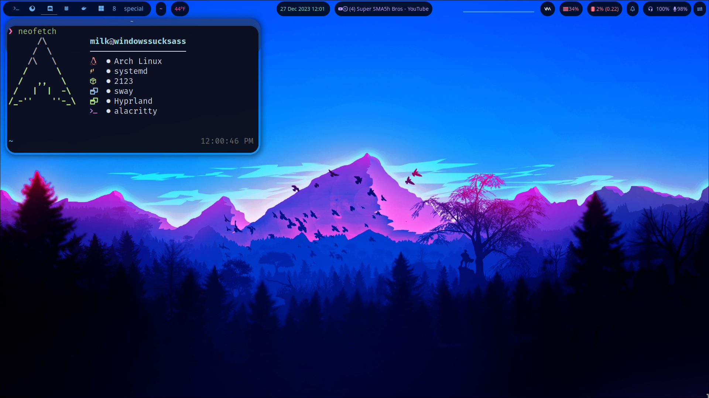
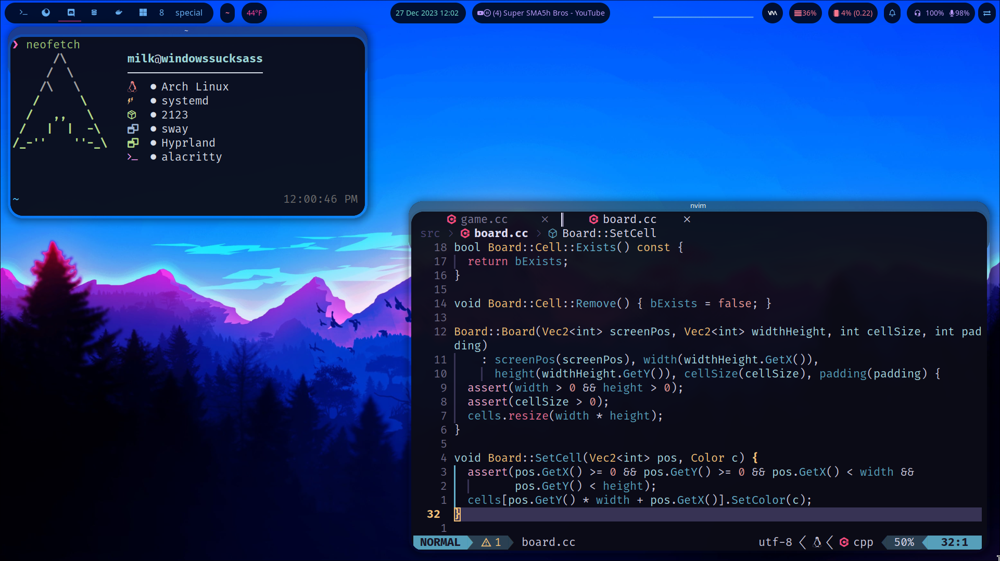

# dotfiles  
Just a place to host my

# Installation
> [!NOTE]
> There will be a script to make this easier soon, will install everything you need to use this
> from deps to the compositor and more.
> That will be coming soon.


## Dependencies
The full list of dependencies will be discovered later, I know that bascially most of what made up [SolDoesTech/HyperV2's](https://github.com/SolDoesTech/HyprV2) dependencies, are very similar to here. Obviously, you will need

- Hyprland
- Waybar, needs to be built with cava support
- Rofi
- Alacritty
- swaync
- wl-clipboard
- hyprpm
- cava and libcava
- hyprshot
- look around the `hypr/` folder in order to find, at least, most of all of what you need.

```sh 
sudo pacman -S hyprland wlroots rofi alacritty wl-clipboard cava hyprpaper

# with what ever aur helper you have, I use paru 
paru -S swaync hyprshot waybar-cava libcava # add hyprland-git, for hyprpm, arch hasn't updated the hyprland package yet.
```

Make sure you make a backup of everything of your configs for Hyprland, waybar, rofi, and neovim. I can't guarantee if it will work on your system.
You might have to do some messing around with this config to get it working.

Clone this repo
```
git clone https://github.com/MilkJug1/dotfiles # note you can clone it anywhere
```

Then either copy the files or use a sym link to make it easier. Script will be available soon.

```sh
cp -r * ~/.config # for copying

# Using a link would be better, cause then you can change it quicker. Using soft links
ln -s /home/$USER/dotfiles/ /home/$USER/.config/ # Change the first path to a spot where this repo is at
# Then add on each folder like /home/$USER/.config/hypr for hypr. I will be making a script soon.
```
>[!IMPORTANT]
> These dotfiles have been made to work with nvidia gpus, as noted by the `hypr/configs/nvidia.conf` file in here, if you aren't running a nvidia gpu, you might want to make sure that file isn't included when you start Hyprland. Just comment out the line
>```
>source=./configs/nvidia.conf
>```

### Multi-Monitor Setup
For anyone with a Multi-monitor setup, change the lines inside of the `hypr/configs/monitors.conf` file in order to have your monitor be setup. Follow [Hyprland's wiki about Monitors to learn more](https://wiki.hyprland.org/Configuring/Monitors/)


## What I use:
- Hyprland, Waybar with rofi, swaync, neovim, and the rest you can see in the Hyprland config

## Pictures






# Inspiration
I was inspired by tons of different configs, I don't remember all but I will try to list as many as I can here that I remember taking from and modifying.

[SolDoesTech/HyperV2](https://github.com/SolDoesTech/HyprV2) I took the background from here, and based my hypr keybindings off of it. Plus a lot of the same deps work here, since I based it off of that first.

[linuxmobile/hyprland-dots](https://github.com/linuxmobile/hyprland-dots/tree/Sakura)
I based the bar off of this and some other stuff that I can't remember.

[ElecTwix/dotfiles](https://github.com/ElecTwix/dotfiles/tree/main) I took his cava config and merged into mine. 

[flick0/dotfiles](https://github.com/flick0/dotfiles) My dots still have remants of this persons, I loved the color theme they did. Plus the bar. Used that bar for a while, parts of it still exist here.

[JoshM-Yoru/dotfiles](https://github.com/JoshM-Yoru/dotfiles/tree/main) The bar is literally just lifted from his, this person has such an amazing looking theme. I don't know if I will keep it but please check it out. Its really good.

There's more, I think, not sure. But, these are most of the people I either took, or inspired my config off of. Please check them out, they have some really nice looking ones.


