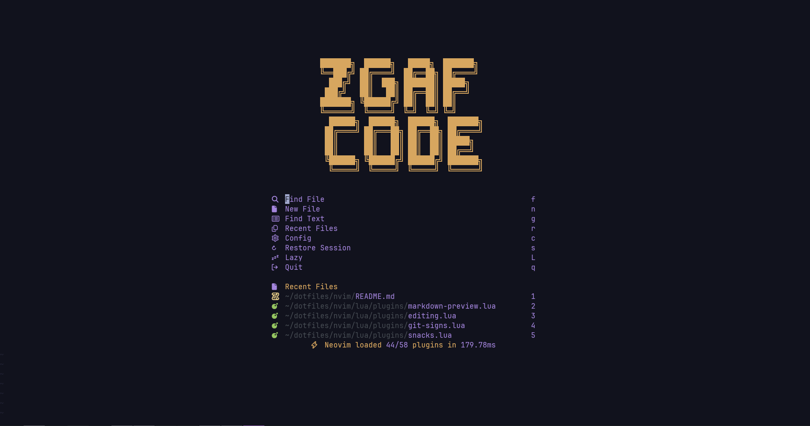
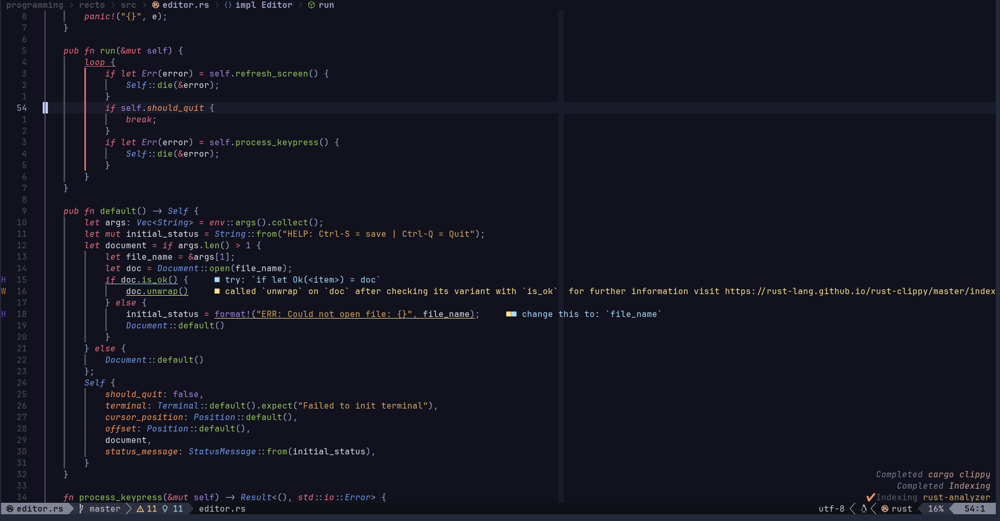
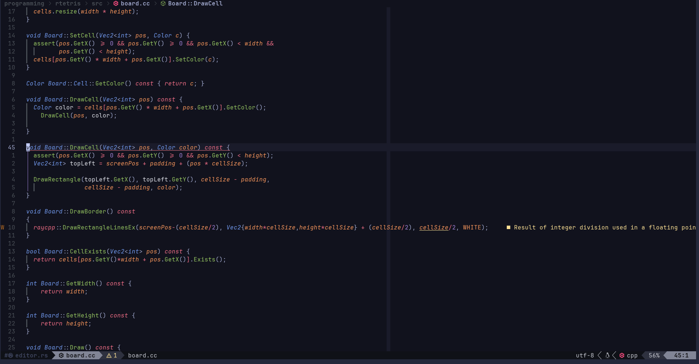
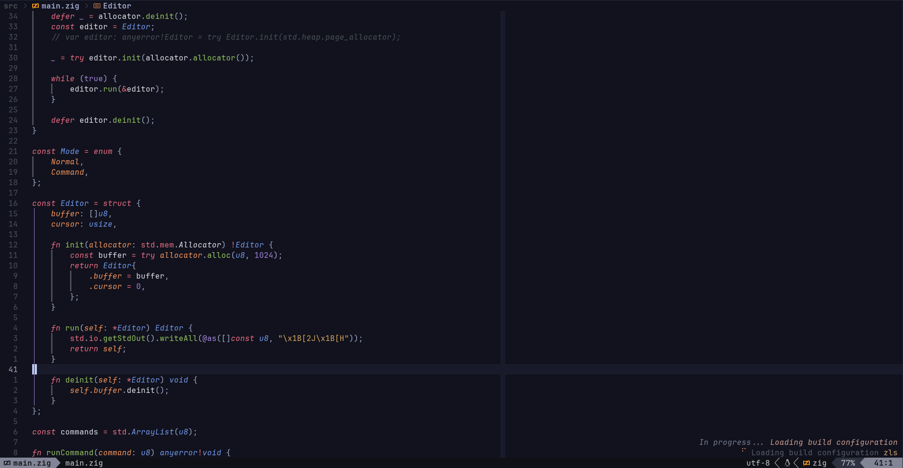

# My Neovim Config

>[!WARNING]
> This is my personal config, it may or may not work for you if you are to use it, please consult the actual config before using.
> Take a look at the bindings inside of `keymaps.lua` or other places inside of the config before using.

### Requirements

- Neovim 0.11+
- fzf
- ripgrep
- LazyGit (Optional)
- A Terminal with image support(Ghostty, Kitty, Wezterm, etc)
- Rust (nightly or stable should work, only for like 2 plugins)
- Nerd Font (I currently use JetBrains Mono Nerd)


#### Showcase








## Introduction & Credits

This part of my dotfiles is my neovim that I've built up over the past few years. It's primarily built on usually a lot of the most normal things in most neovim configs(noice.nvim, todo-comments, and more) 

I've based this config on many creators over the past years of using neovim, I just recently switched from LazyVim a couple of years ago and decided to start from scratch. There's so many people that I've gotten plugins from and based the overall usage of my config that it would be a tribial task to credit everyone, but bascially almost anyone on the front page of Youtube for when looking up anything with Neovim.

This list includes people like:
- The Primagen
- Typecraft
- TJ DeVries 
- Bread On Penguins
- DevOps ToolBox
- Mental Outlaw
- Linkarzu
- Josean Martinez
- And many more..

The overall entire Neovim community is where I have been able to locate and be able to utilize these plugins that are currently in this repo.

## Goals

This is a config that is mainly aimed at hitting these goals:
- Easily extendable
- Works with minimal support 
- Easy to grasp keybinds (Easy to grasp keybinds for me, which at the moment is debatable)
- Structured nicely
- Has out-of-the-box support for the languages that I use most,
    * Rust 
    * C/C++
    * Zig
    * Python
    * Markdown
    * Lua
    * Bash
- Has good themes
- Works fine with Neovide
- More stable
- Be able to be used in non-programming situations


> [!NOTE]
> This is a configuration that is aimed to work the way that I work inside a project and programming in general. 
> I have tried to make the keybindings as sensible as possible for both me and anyone who may consider using my config either as their basis for their config, or as their daily runner.
> If something is breaking or a keymap is not working for you, luckily changing it is very easy, everything is inside of `keymaps.lua`(aside from very specific plugins where their keymaps are handled inside of their own respective plugin file.)


## Structure 

I have tried to strucutre my config in a way that allows for easy configuring while also providing a way to add onto the existing config, mainly for the sake of my sanity. 

Being able to add or remove a specific plugin or plugins was my main goal, as I was having issues with plugins breaking other plugins and with the way that my previous `plugins.lua` file was very unstructured.

### Tree of my config.
```
├── init.lua
├── lazy-lock.json
├── lua
│   ├── configs
│   │   ├── alpha.lua
│   │   ├── autopairs.lua
│   │   ├── blink.lua
│   │   ├── bufferline.lua
│   │   ├── cmp.lua
│   │   ├── code-shot.lua
│   │   ├── dap_config.lua
│   │   ├── indent-blankline.lua
│   │   ├── init.lua
│   │   ├── noice.lua
│   │   ├── oil.lua
│   │   ├── rustaceanvim.lua
│   │   ├── rust-tools.lua
│   │   ├── telescope.lua
│   │   ├── todo-comments.lua
│   │   ├── treesitter.lua
│   │   └── which-key.lua
│   ├── globals.lua
│   ├── keymaps.lua
│   ├── options.lua
│   ├── plugins
│   │   ├── alpha.lua
│   │   ├── blink.lua
│   │   ├── completions.lua
│   │   ├── editing.lua
│   │   ├── git-signs.lua
│   │   ├── lazydev.lua
│   │   ├── lsp-config.lua
│   │   ├── lualine.lua
│   │   ├── markdown-preview.lua
│   │   ├── mini-nvim.lua
│   │   ├── none-ls.lua
│   │   ├── nvim-rs.lua
│   │   ├── oil.lua
│   │   ├── snacks.lua
│   │   ├── telescope.lua
│   │   ├── themes.lua
│   │   ├── treesitter.lua
│   │   ├── trouble.lua
│   │   └── which-key.lua
│   └── start.lua
├── README.md
└── TODO.md
```

- `plugins/` is a directory that handles all of the plugins installed, some of the plugins have configurations there, while some other ones may have it inside of the `configs/` folder. Some keymaps for certain plugins are also inside of here.
- `configs/` I feel is pretty self-explanatory, some plugins have configurations there.
- `keymaps.lua`, This is where the *majority* of the keymaps are located.
- `options.lua`, Editor configurations that control colorscheme, font type, font size, and some other Neovim specific things.
